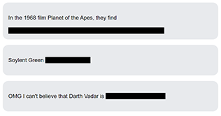
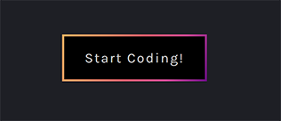
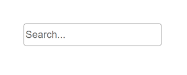
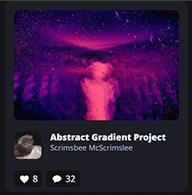
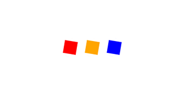
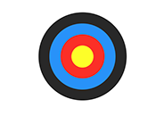

# 🎨 [CSS Mini Projects](https://prantomollick.github.io/css-mini-projects/)

This repository contains a collection of mini projects built using CSS. Each project demonstrates different CSS techniques and concepts, ranging from basic styling to advanced animations. Perfect for anyone looking to improve their CSS skills through hands-on practice.

# Table of Contents

1. ⬇️ [Installation](#installation)
2. ⚙️ [Tech Stack](#tack-stack)
3. 📋 [Projects](#projects)
4. 🤝 [Connect With me](#contact)
5. 🧾 [Credit](#credit)

## <a name="installation">⬇️ Installation</a>

Follow these steps to set up the project locally on your machine.

**Prerequisites**
Make sure you have the following installed on your machine:

-   [Git](https://git-scm.com/)
-   [Visual Studio Code](https://code.visualstudio.com/) 🔧
-   [Live Preview vs code extension](https://marketplace.visualstudio.com/items?itemName=ms-vscode.live-server)

**Cloning the Repository**

```bash
$ git clone https://github.com/prantomollick/css-mini-projects.git
$ cd css-mini-projects
```

## <a name="tack-stack">⚙️ Tech Stack</a>

-   HTML5
-   CSS 3

## <a name="projects">📋 Projects</a>

1. [Spoiler Revealer](#spoiler-revealer)
2. [Colorful Button](#colorful-button)
3. [Expanding Search Bar](#expanding-search-bar)
4. [Codepan Tile](#codepan-tile)
5. [Loading Animation](#loading-animation)
6. [Loading Animation 2](#loading-animation-2)
7. [Archery Target](#archery-target)

### <a name="spoiler-revealer">Spoiler Revealer</a>

[](https://prantomollick.github.io/css-mini-projects/1-spoiler-revealer/index.html)

### <a name="colorful-button">Colorful Button</a>

[Colorful Button](https://prantomollick.github.io/css-mini-projects/2-colorful-button/index.html)

### <a name="expanding-search-bar">Expanding Search Bar</a>

[Expanding Search Bar](https://prantomollick.github.io/css-mini-projects/3-expanding-search-bar/index.html)

### <a name="codepan-tile">Codepan Tile</a>

[Codepan Tile](https://prantomollick.github.io/css-mini-projects/4-codepan-tile/index.html)

### <a name="loading-animation">Loading Animation</a>

[Loading Animation](https://prantomollick.github.io/css-mini-projects/5-loading-animation/index.html)

### <a name="loading-animation-2">Loading Animation 2</a>

[Loading Animation 2](https://prantomollick.github.io/css-mini-projects/6-loading-animation-2/index.html)

### <a name="archery-target">Archery Target</a>

[Archery Target](https://prantomollick.github.io/css-mini-projects/7-archery-target/index.html)
