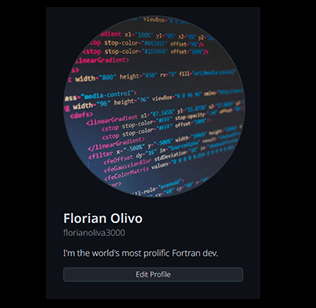
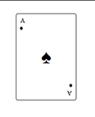
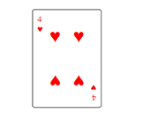
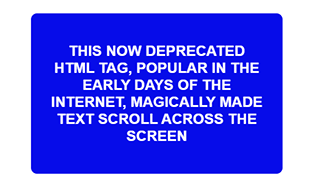
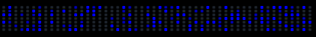

# 🎨 [CSS Mini Projects](https://prantomollick.github.io/css-mini-projects/)

This repository contains a collection of mini projects built using CSS. Each project demonstrates different CSS techniques and concepts, ranging from basic styling to advanced animations. Perfect for anyone looking to improve their CSS skills through hands-on practice.

# Table of Contents

1. ⬇️ [Installation](#installation)
2. ⚙️ [Tech Stack](#tack-stack)
3. 📋 [Projects](#projects)
4. 🤝 [Connect With me](#contact)
5. 🧾 [Credit](#credit)

## <a name="installation">⬇️ Installation</a>

Follow these steps to set up the project locally on your machine.

**Prerequisites**
Make sure you have the following installed on your machine:

-   [Git](https://git-scm.com/)
-   [Visual Studio Code](https://code.visualstudio.com/) 🔧
-   [Live Preview vs code extension](https://marketplace.visualstudio.com/items?itemName=ms-vscode.live-server)

**Cloning the Repository**

```bash
$ git clone https://github.com/prantomollick/css-mini-projects.git
$ cd css-mini-projects
```

## <a name="tack-stack">⚙️ Tech Stack</a>

-   HTML5
-   CSS 3

## <a name="projects">📋 Projects</a>

1. [Spoiler Revealer](#spoiler-revealer)
2. [Colorful Button](#colorful-button)
3. [Expanding Search Bar](#expanding-search-bar)
4. [Codepan Tile](#codepan-tile)
5. [Loading Animation](#loading-animation)
6. [Loading Animation 2](#loading-animation-2)
7. [Archery Target](#archery-target)
8. [Word Carousel](#8-word-carousel)
9. [Flag Of France](#9-flag-of-france)
10. [Flag Of Germany](#10-flag-of-germany)
11. [Flag Of Madgascar](#11-flag-of-madgascar)
12. [Flag of Switzerland](#12-flag-of-switzerland)
13. [Flag Of Japan](#13-flag-of-japan)
14. [Flag-of-sweden](#14-flag-of-sweden)
15. [Flag-of-Niger](#15-flag-of-Niger)
16. [Github-profile-layout](#16-github-profile-layout)
17. [Toggle-switch](#17-toggle-switch)
18. [Playing-card-ace-of-spades](#18-playing-card-ace-of-spades)
19. [Playing-card-4-of-hearts](#19-playing-card-4-of-hearts)
20. [Adjustable-progress-bar](#20-adjustable-progress-bar)
21. [Jeopardy-card-flip](#21-jeopardy-card-flip)
22. [Loading-animation-3](#22-loading-animation-3)
23. [Instagram-stories-menu](#23-instagram-stories-menu)
24. [Animated-progress-bar](#24-animated-progress-bar)
25. [Github-contributions-graph](#25-github-contributions-graph)

### <a name="spoiler-revealer">Spoiler Revealer</a>

[](https://prantomollick.github.io/css-mini-projects/1-spoiler-revealer/index.html)

### <a name="colorful-button">Colorful Button</a>

[](https://prantomollick.github.io/css-mini-projects/2-colorful-button/index.html)

### <a name="expanding-search-bar">Expanding Search Bar</a>

[](https://prantomollick.github.io/css-mini-projects/3-expanding-search-bar/index.html)

### <a name="codepan-tile">Codepan Tile</a>

[](https://prantomollick.github.io/css-mini-projects/4-codepan-tile/index.html)

### <a name="loading-animation">Loading Animation</a>

[](https://prantomollick.github.io/css-mini-projects/5-loading-animation/index.html)

### <a name="loading-animation-2">Loading Animation 2</a>

[](https://prantomollick.github.io/css-mini-projects/6-loading-animation-2/index.html)

### <a name="archery-target">Archery Target</a>

[](https://prantomollick.github.io/css-mini-projects/7-archery-target/index.html)

### <a name="8-word-carousel">Word Carousel</a>

[](https://prantomollick.github.io/css-mini-projects/8-word-carousel/index.html)

### <a name="9-flag-of-france">Flag Of France</a>

[](https://prantomollick.github.io/css-mini-projects/9-flag-of-france/index.html)

### <a name="10-flag-of-germany">Flag Of Germany</a>

[](https://prantomollick.github.io/css-mini-projects/10-flag-of-germany/index.html)

### <a name="11-flag-of-madgascar">Flag Of Madgascar</a>

[](https://prantomollick.github.io/css-mini-projects/11-flag-of-madgascar/index.html)

### <a name="12-flag-of-switzerland">Flag Of Switzerland</a>

[](https://prantomollick.github.io/css-mini-projects/12-flag-of-switzerland/index.html)

### <a name="13-flag-of-japan">Flag Of Japan</a>

[](https://prantomollick.github.io/css-mini-projects/13-flag-of-japan/index.html)

### <a name="14-flag-of-sweden">Flag of Sweden</a>

[](https://prantomollick.github.io/css-mini-projects/14-flag-of-sweden/index.html)

### <a name="15-flag-of-Niger">flag of Niger</a>

[](https://prantomollick.github.io/css-mini-projects/15-flag-of-Niger/index.html)

### <a name="16-github-profile-layout">Github Profile Layout</a>

[](https://prantomollick.github.io/css-mini-projects/16-github-profile-layout/index.html)

### <a name="17-toggle-switch">Toggle Switch</a>

[](https://prantomollick.github.io/css-mini-projects/17-toggle-switch/index.html)

### <a name="18-playing-card-ace-of-spades">Playing Card Ace Of Spades</a>

[](https://prantomollick.github.io/css-mini-projects/18-playing-card-ace-of-spades/index.html)

### <a name="19-playing-card-4-of-hearts">Playing Card 4 Of Hearts</a>

[](https://prantomollick.github.io/css-mini-projects/19-playing-card-4-of-hearts/index.html)

### <a name="20-adjustable-progress-bar">Adjustable Progress Bar</a>

[](https://prantomollick.github.io/css-mini-projects/20-adjustable-progress-bar/index.html)

### <a name="21-jeopardy-card-flip">Jeopardy Card Flip</a>

[](https://prantomollick.github.io/css-mini-projects/21-jeopardy-card-flip/index.html)

### <a name="22-loading-animation-3">Loading Animation 3</a>

[](https://prantomollick.github.io/css-mini-projects/22-loading-animation-3/index.html)

### <a name="23-instagram-stories-menu">Instagram Stories Menu</a>

[](https://prantomollick.github.io/css-mini-projects/23-instagram-stories-menu/index.html)

### <a name="24-animated-progress-bar">Animated Progress Bar</a>

[](https://prantomollick.github.io/css-mini-projects/24-animated-progress-bar/index.html)

### <a name="25-github-contributions-graph">Github Contributions Graph</a>

[](https://prantomollick.github.io/css-mini-projects/25-github-contributions-graph/index.html)

## <a name="contact">🤝 Connect With me</a>

👥 [@prantomollick](https://www.linkedin.com/in/prantomollick/)
❌ [@prantomollick55](https://x.com/prantomollick55)
✉️ [prantomollick01@gmail.com](mailto:prantomollick01@gmail.com)
🌎 https://prantomollick.com

## <a name="credit">🧾 Credit</a>

<em><samll><author>@trezpTreasure Porth</author> [CSS Challenges](https://v2.scrimba.com/css-challenges-c02p)</samll></em>
